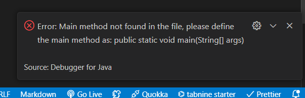

# Pertemuan 2 - Jobsheet 2 Object

Nama : Riovaldo Alfiyan Fahmi Rahman<br>
NIM : 2341720209<br>
Tugas : Jobsheet 2<br>

## 2.1 Percobaan 1 : Deklarasi Class, Atribut dan Method

Code :

```
public class Buku24 {
    String judul, pengarang;
    int halaman, stok, harga;
    void tampilInformasi(){
        System.out.println("Judul : " + judul);
        System.out.println("Pengarang : " + pengarang);
        System.out.println("Jumlah Halaman : " + halaman);
        System.out.println("Sisa stok : " + stok);
        System.out.println("Harga : Rp " + harga);
    }

    void terjual (int jml){
        stok -= jml;
    }

    void restock (int jml){
        stok += jml;
    }

    void gantiHarga (int hrg){
        harga = hrg;
    }
}
```

### 2.1.2 Verifikasi Hasil Percobaan

Hasilnya akan error


### 2.1.3 Pertanyaan

1. Sebutkan dua karakteristik class atau object!

   JAWAB :

   - Encapsulation ( Enkapsulasi ) dan Inheritance ( Pewarisan )

2. Perhatikan class Buku pada Praktikum 1 tersebut, ada berapa atribut yang dimiliki oleh class Buku? Sebutkan apa saja atributnya!

   JAWAB :

   - judul : String
   - pengarang : String
   - halaman : int
   - stok : int
   - harga : int

3. Ada berapa method yang dimiliki oleh class tersebut? Sebutkan apa saja methodnya!

   JAWAB :

   - tampilInformasi()
   - terjual()
   - restock()
   - gantiHarga()

4. Perhatikan method terjual() yang terdapat di dalam class Buku. Modifikasi isi method tersebut
   sehingga proses pengurangan hanya dapat dilakukan jika stok masih ada (lebih besar dari 0)!

   JAWAB :

```

void terjual(int jml) {
if (stok > 0) {
stok -= jml;
System.out.println(jml + " buku terjual. Sisa stok: " + stok);
} else {
System.out.println("Stok tidak mencukupi untuk melakukan penjualan.");
}
}

```

5. Menurut Anda, mengapa method restock() mempunyai satu parameter berupa bilangan int?

JAWAB :

- Menurut saya alasan method restock() mempunyai satu parameter yaitu bilangan bulat (int) dikarenakan jumlah tambahan buku yang akan ditambahkan ke dalam stok, dengan begitu parameter jml akan mewakili jumlah buku tambahan yang akan direstock ke dalam stok buku yang sudah ada.

6. Commit dan push kode program ke Github

